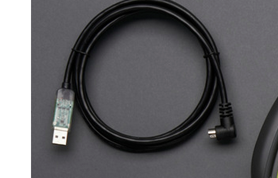

#### roomba_cpp, Simple C++ library for Roomba iCreate 2 

Roomba library C++

Files : Roomba.cpp, Roomba.h 

This library is complete and self contained and will run only on Mac, Linux, Raspberry-PI and Beaglebone (should run without any problem, but I have not tested it yet) 

To communicate with iCreate2 you need the FTDI cable like the one shown below 




If you dont have one you can easily hack one, please follow the instructions in these links to make one yourself, ````Note: The serial port in Roomba iCreate2 is a miniDin connector````

The main.cpp contains a sample of how to use the library, Right now the events supported are only bump events, I will be making changes to add more events and features

Compiling and running the main.cpp (sample program)

First make the object files 

````

	** Compile **
	Roomba master % g++ -c Roomba.cpp 
	Roomba master % g++ -o ./test main.cpp Roomba.o 
	
	** Run **
	./test 
	
	Now you shoule hear first few notes of Vuelie from frozen movie and the robot will spin for 10 seconds 
	
````


Sample code 

````
	
	//
//  main.cpp
//  Roomba
//
//  Created by janakiraman gopinath on 2/27/15.
//  Copyright (c) 2015 org.koneksahealth.com. All rights reserved.
//

#include <iostream>
#include "Roomba.h"

void eventf(char *buf) {
    printf("%s\n", buf);
}
int main(int argc, const char * argv[]) {
    
    Roomba *r = new Roomba((char *) "/dev/tty.usbserial-DA017QCF", B115200);
    
    r->printCommands();
    
    if (r->getStatus())
        cout << "Robot initialized successfully" << endl;
    else
        cout << "Failed to initialize robot" << endl;
    
    r->bumpSignal(eventf);
    array<int, 32> songSequence;
    
    // GGGAGG GAABGA
    //G
    songSequence[0] = 91;
    songSequence[1] = 32;
    //G
    songSequence[2] = 91;
    songSequence[3] = 32;
    //G
    songSequence[4] = 91;
    songSequence[5] = 32;
    //A
    songSequence[6] = 93;
    songSequence[7] = 32;
    //G
    songSequence[8] = 91;
    songSequence[9] = 32;
    //G
    songSequence[10] = 91;
    songSequence[11] = 48;
    // G
    songSequence[12] = 91;
    songSequence[13] = 32;
    //A
    songSequence[14] = 93;
    songSequence[15] = 32;
    //A
    songSequence[16] = 93;
    songSequence[17] = 32;
    //B
    songSequence[18] = 95;
    songSequence[19] = 32;
    //G
    songSequence[20] = 91;
    songSequence[21] = 32;
    //A
    songSequence[22] = 93;
    songSequence[23] = 32;
   
    // 12 Midi sequences from the array  
    r->createSong(0, 12, songSequence);
    r->playSong(0);
    r->spin(1); // -1 for clockwise spin
    sleep(10);
    //r->drive(500, 0); // Velocity and angle
    r->stop(); // Finally stop the robot
    
    return 0;
}
````